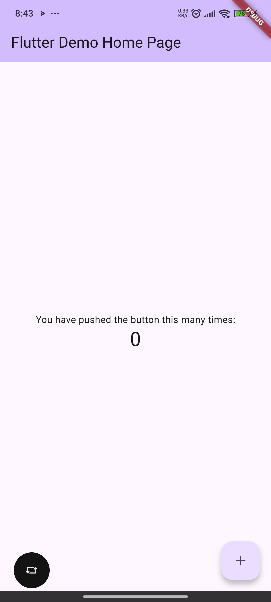
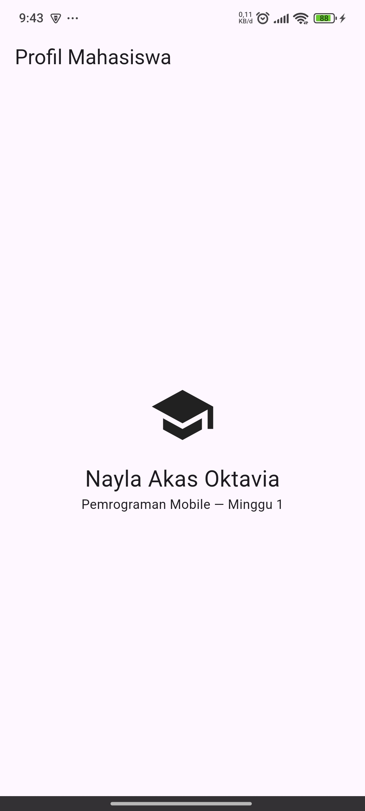
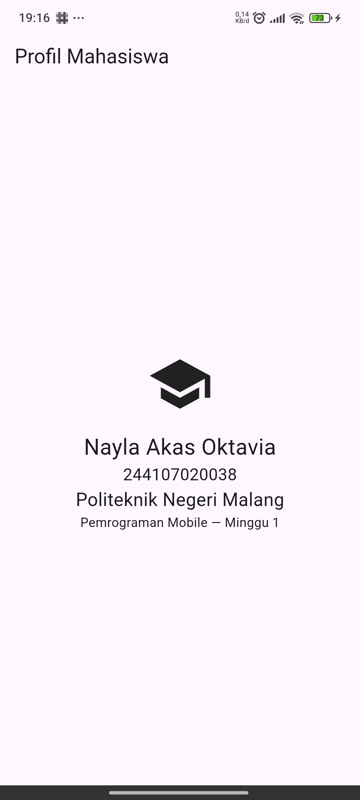

|  | Pemrograman Mobile |
|--|--|
| NIM |  244107020038|
| Nama |  Nayla Akas Oktavia |
| Kelas | TI - 3H |
| Repository | [link] (https://github.com/naylaakas/244107020038-mobile-course/tree/main/01-week-1-mobile-development-ecosystem-flutter-refresh) |

# WEEK 1
## Mobile Development Ecosystem & Flutter Refresh

### Tujuan

Mempelajari dasar pengembangan aplikasi mobile menggunakan Flutter

### Fitur Utama

1. Menampilkan halaman profil mahasiswa
2. Menampilkan ikon sekolah
3. Menampilkan nama dari mahasiswa
4. Menampilkan mata kuliah
5. Mengubah tampilan UI dari halaman default Flutter

### Stack Teknologi

1. Flutter
2. Android Studio
3. VS Code
4. Git
5. GitHub

### Hasil

Tampilan awal:

Tampilan setelah UI diubah:

### Mini Assignment

menambahkan NIM dan nama kampus

#### Refleksi

1. Kapan native lebih tepat dipilih daripada cross-platform?
    Ketika aplikasi membutuhkan performa tinggi, akses fitur perangkat yang sangat spesifik, atau pengalaman yang benar-benar mengikuti platform

2. Bagaimana perubahan state berhubungan dengan widget tree dan UI deklaratif?
    Widget tree merepresentasikan struktur UI berdasarkan state saat ini, sehingga ketika state berubah, Flutter melakukan rebuild dan menghasilkan tampilan yang sesuai dengan state terbaru

3. Mengapa commit kecil dengan pesan jelas bermanfaat bagi pekerjaan tim dan portfolio?
    Commit kecil membuat perubahan lebih mudah dilacak dan dikelola, sedangkan pesan yang jelas membuat kontribusi lebih mudah dipahami oleh orang yang melihat portfolio kita