|  | Pemrograman Mobile |
|--|--|
| NIM |  244107020038|
| Nama |  Nayla Akas Oktavia |
| Kelas | TI - 3H |
| Repository | [link] () |

# WEEK 3
## Navigation & State Management

### Praktikum 1 — Aplikasi multi-page dengan GoRouter

- Buat project baru 

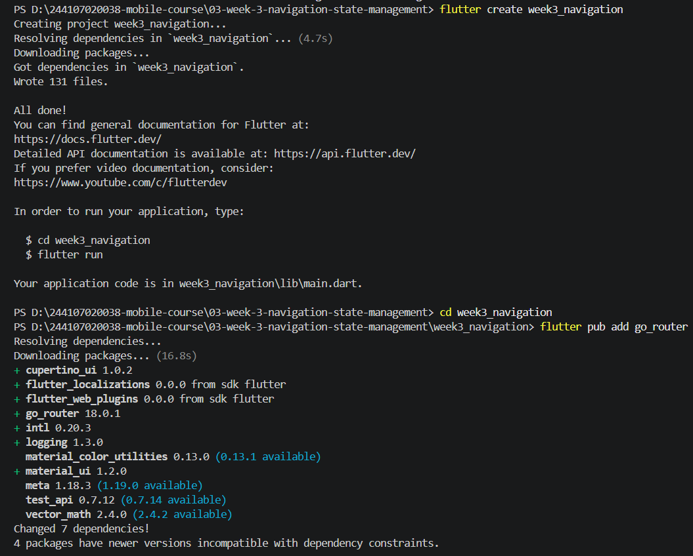

- Hasil:

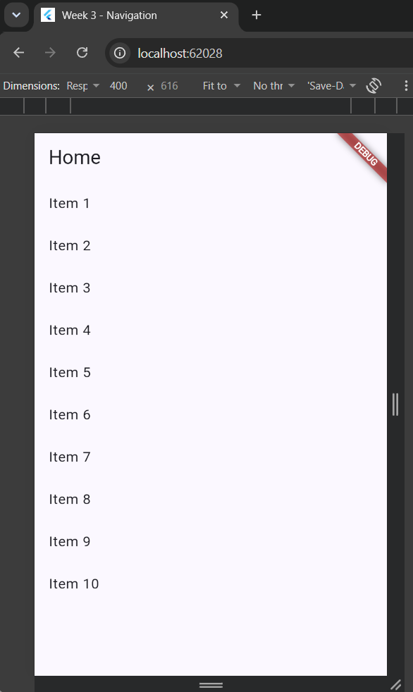

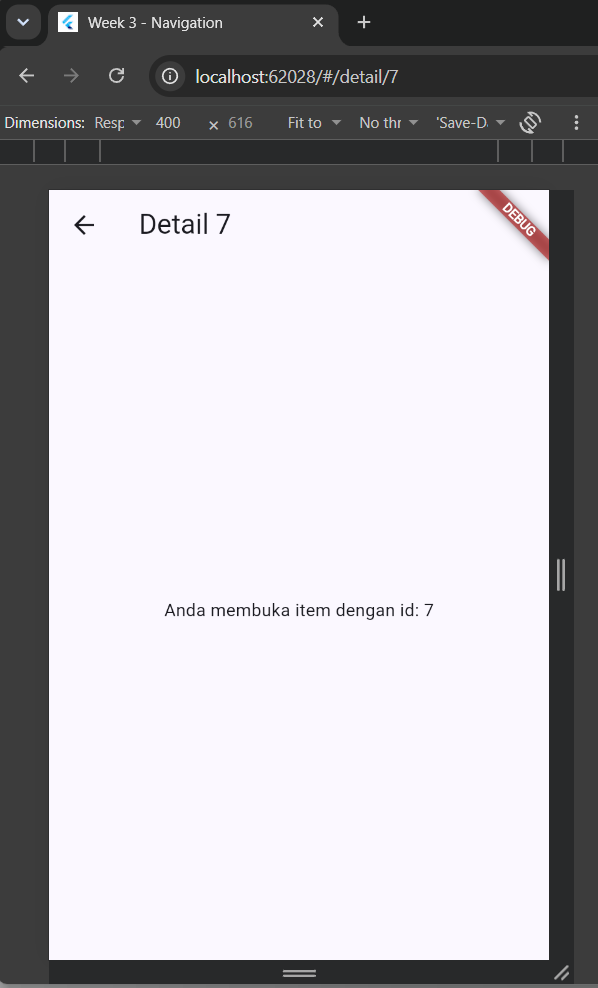

### Praktikum 2 — Aplikasi ToDo dengan Riverpod

- Buat project baru 

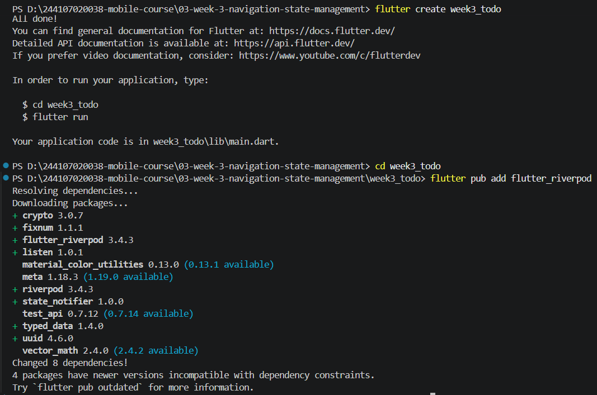

- Hasil:

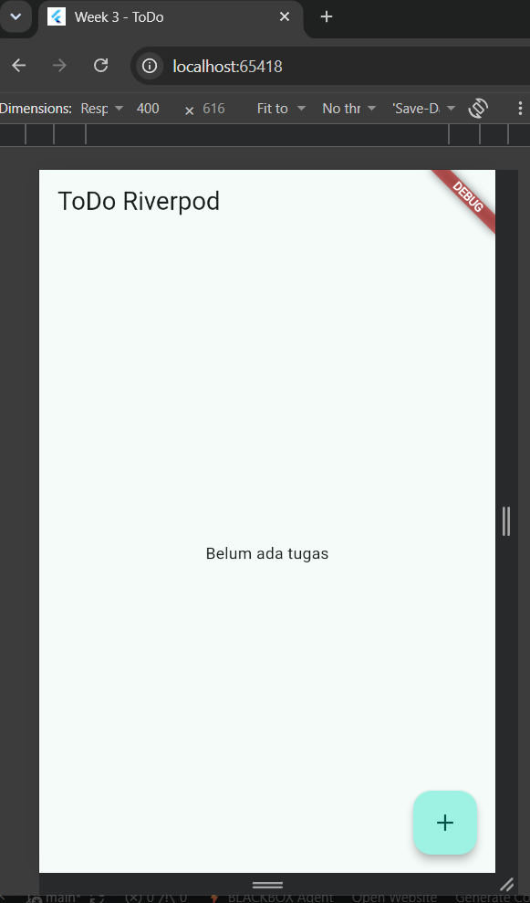

### Praktikum 3 — Uji ketiga state

1. Salin kode di atas ke project ToDo Anda (atau project terpisah) dan jalankan. Amati tampilan loading selama 2 detik pertama

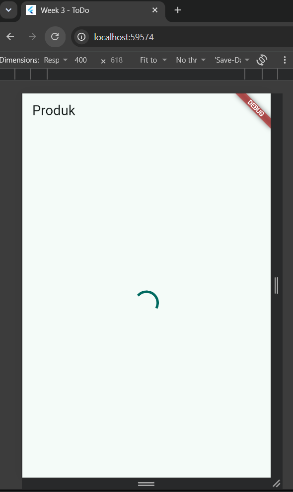

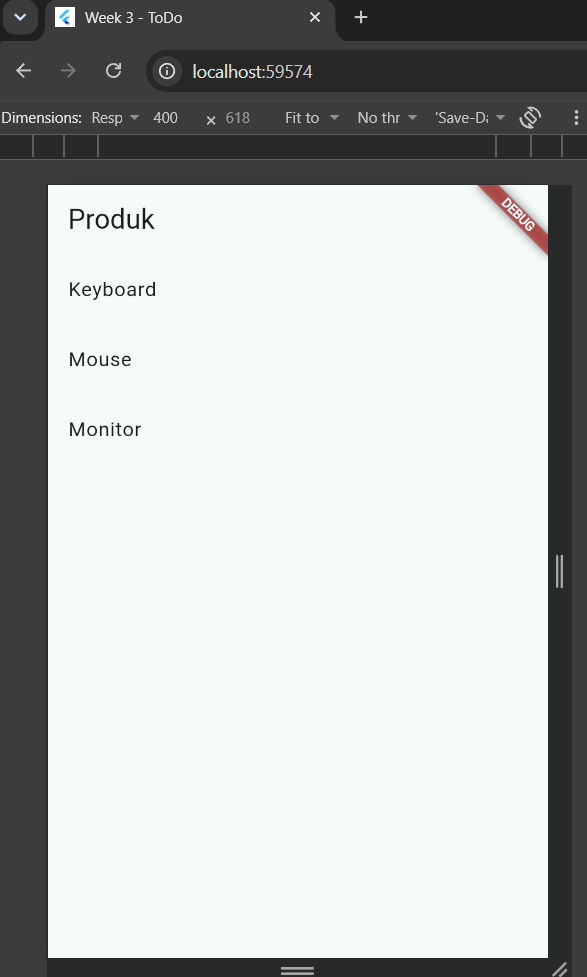

2. Ubah build() sementara untuk melempar error: throw Exception('Gagal terhubung ke server');. Jalankan dan amati UI error beserta tombol Coba lagi

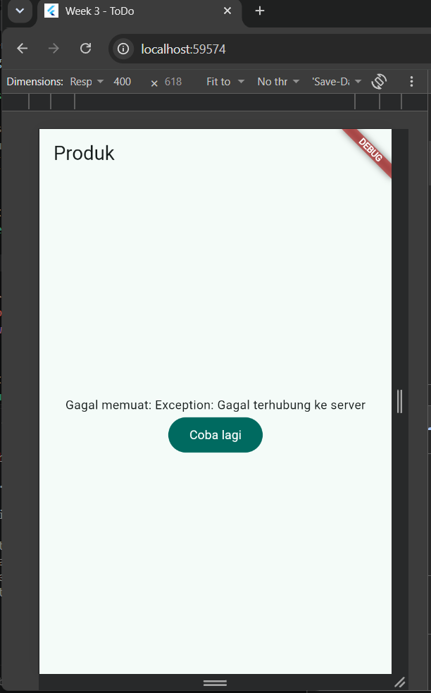

3. Tekan tombol Coba lagi, ref.invalidate membuat provider dijalankan ulang. Pulihkan kode, pastikan state success tampil

4. Refleksikan: mengapa menampilkan ulang data lama (stale data) dengan indikator refresh kadang lebih baik daripada mengosongkan layar? Kapan pola itu penting?
    Karena pengguna masih bisa melihat informasi yang sebelumnya sudah tersedia, daripada melihat layar kosong saat data sedang diperbarui. Pola tersebut penting pada feed, daftar berita, chat, atau dashboard yang datanya sering diperbarui.

### AI Challenge

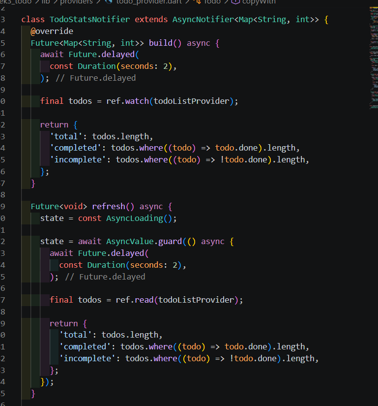

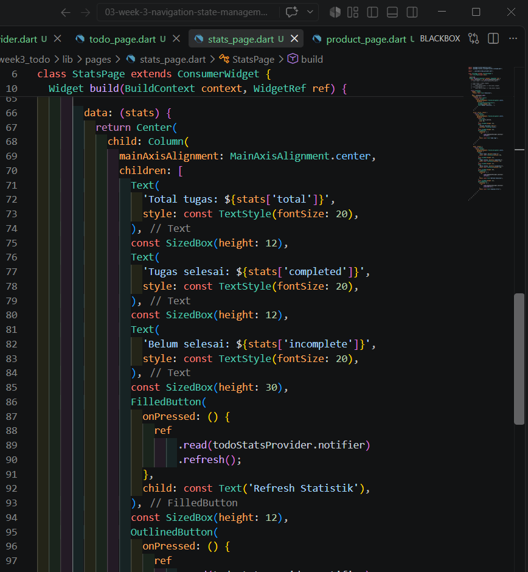

- Analyze n test

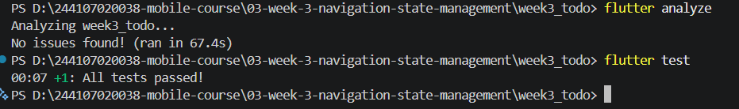

- AI checklist

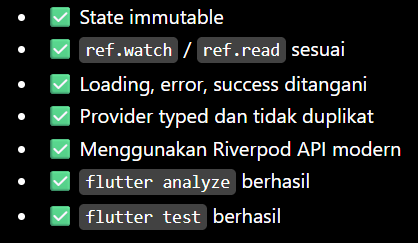

### Refactoring Challenge

1. Pisahkan widget bar ToDo menjadi TodoTile tersendiri agar build lebih pendek dan mudah diuji.
2. Ekstrak logika filter (misal tampilkan hanya yang belum selesai) menjadi Provider turunan yang membaca todoListProvider.
3. Integrasikan aplikasi ToDo dengan GoRouter: / untuk daftar dan /stats untuk halaman statistik, tambahkan NavigationBar untuk berpindah.

Hasil:

- 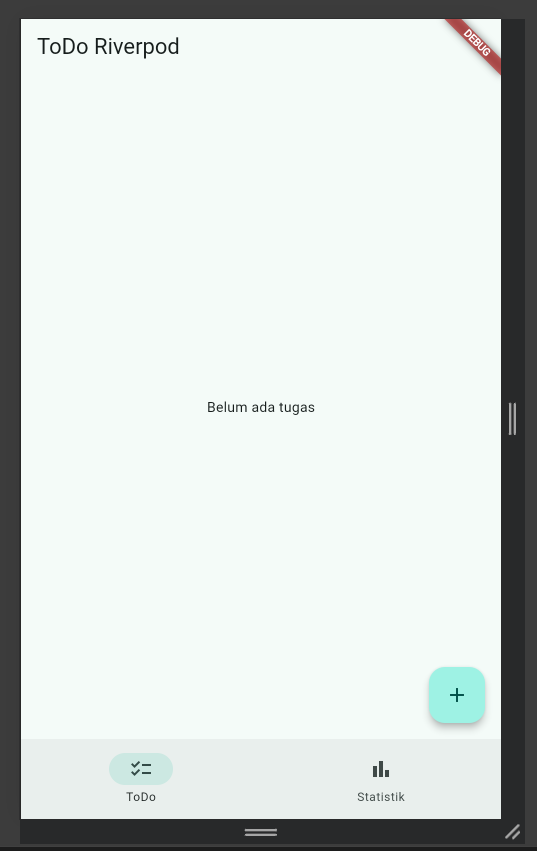

- 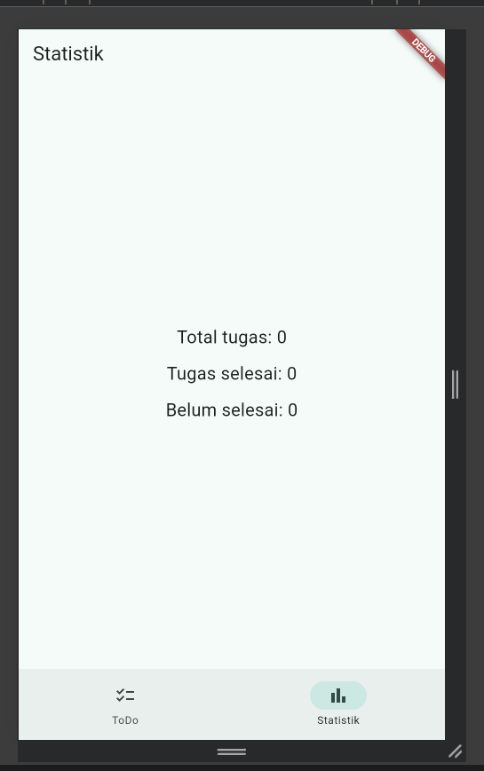

### Testing 

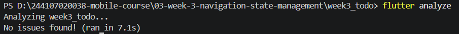

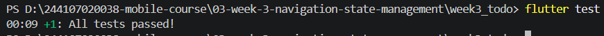

### Mini project / Industry Challenge

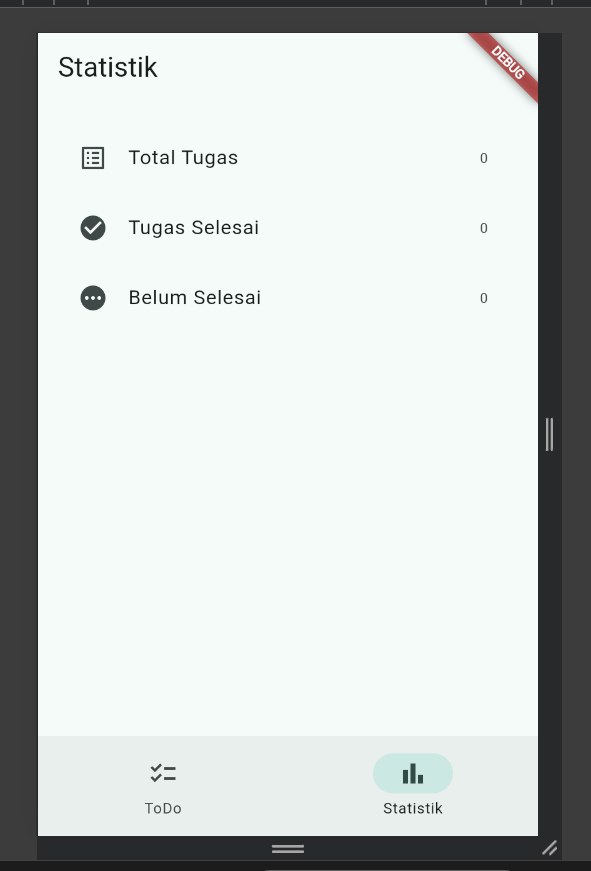

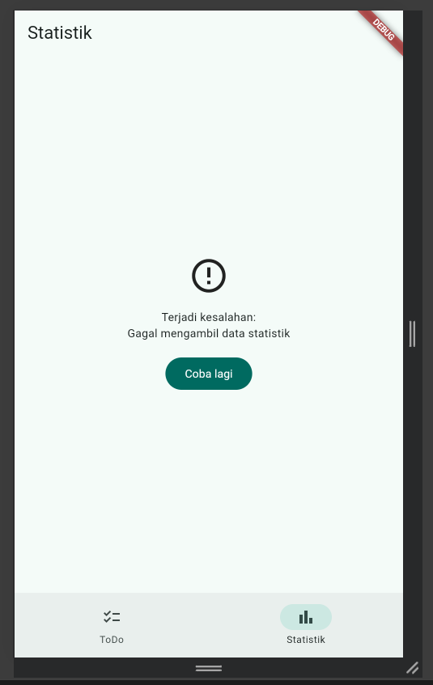

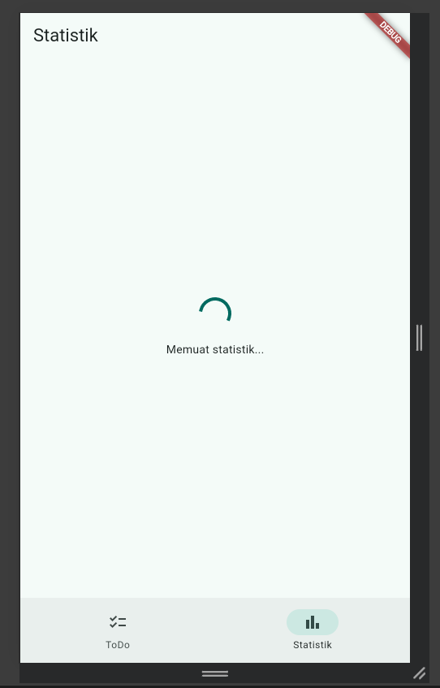

### Refleksi

1. Kapan setState masih cukup, dan kapan state harus naik ke Riverpod?
    setState cukup kalau state hanya digunakan oleh satu widget. Riverpod lebih cocok kalau state perlu digunakan oleh beberapa widget/halaman

2. Apa perbedaan context.go dan context.push, dan kapan masing-masing tepat digunakan?
    - context.go: berpindah ke halaman baru dan mengganti route saat ini

    - context.push: membuka halaman baru di atas halaman sebelumnya, sehingga bisa kembali dengan tombol Back

3. Bagaimana AsyncValue mencegah bug dibanding tiga boolean terpisah?
    AsyncValue menyatukan kondisi proses asynchronous seperti loading, data berhasil, dan error dalam satu state

4. Bagian mana dari hasil AI yang Anda perbaiki, dan mengapa?

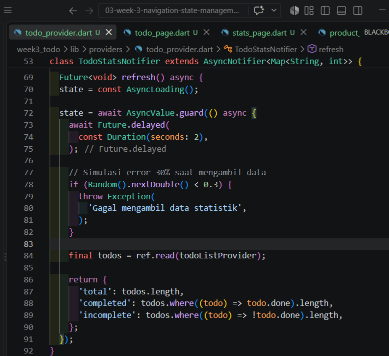

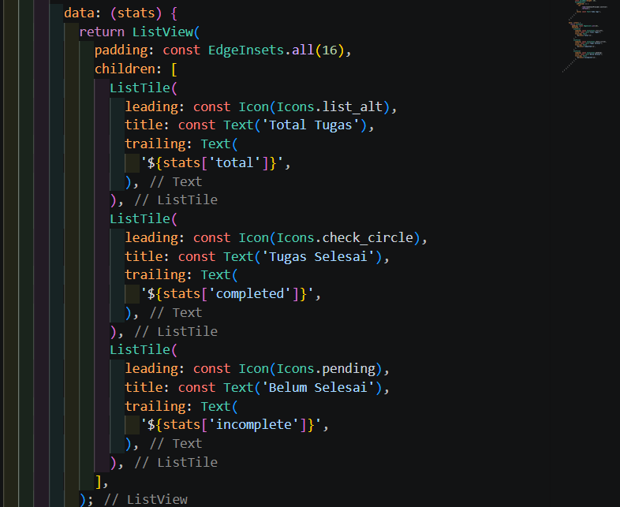

Memperbaiki bagian simulasi error 30% dan StatsPage. Perbaikannya adalah memastikan error dapat ditangani menggunakan AsyncNotifier dan AsyncValue, serta menambahkan tampilan loading, error, data, dan tombol “Coba lagi”