|  | Pemrograman Mobile |
|--|--|
| NIM |  244107020038|
| Nama |  Nayla Akas Oktavia |
| Kelas | TI - 3H |
| Repository | [link] () |

# WEEK 4
## Networking & REST API

### Praktikum 1 — Dio dan model data

- Buat project baru 

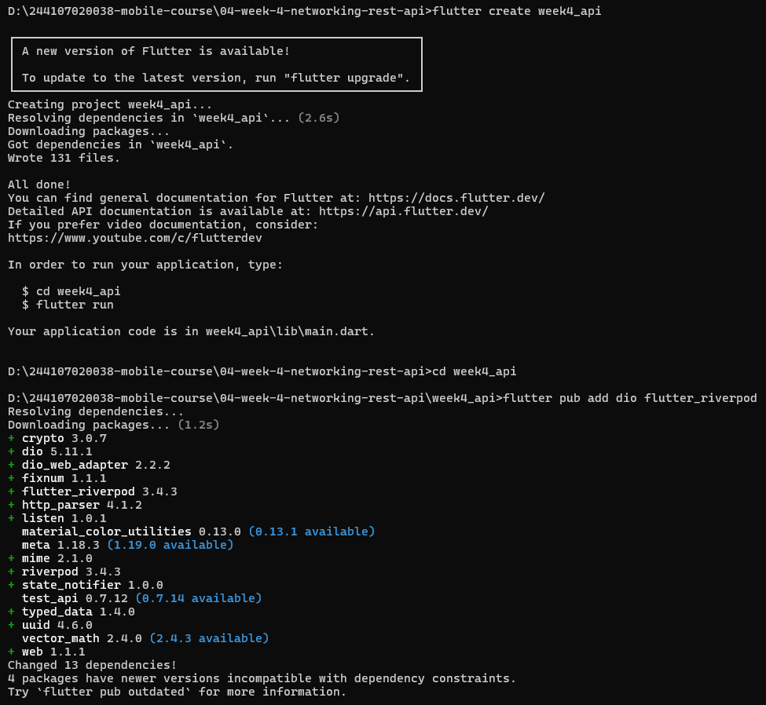

### Praktikum 2 — Provider dan error handling

Uji 3 skenario error:

1. Jalankan aplikasi dengan internet normal, amati loading lalu daftar 100 posts.

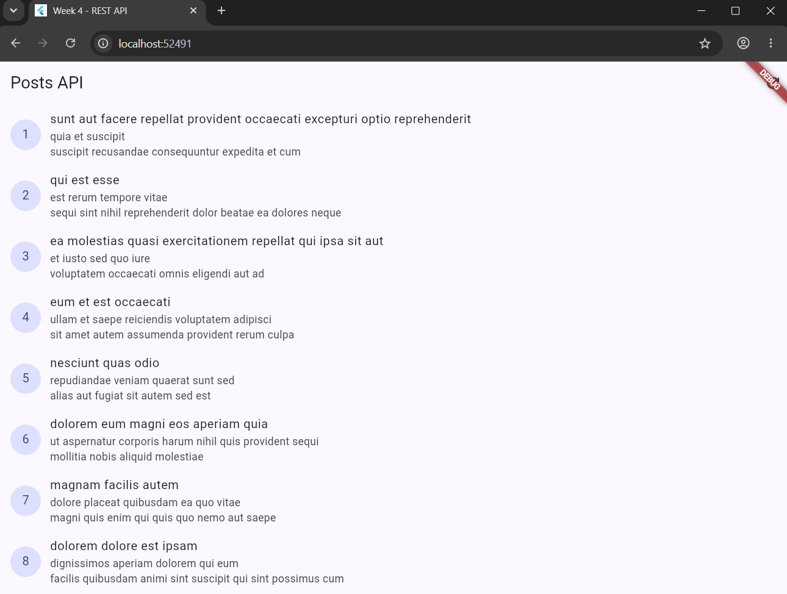

2. Matikan internet (mode pesawat), tekan refresh, amati pesan ramah + tombol Coba lagi.

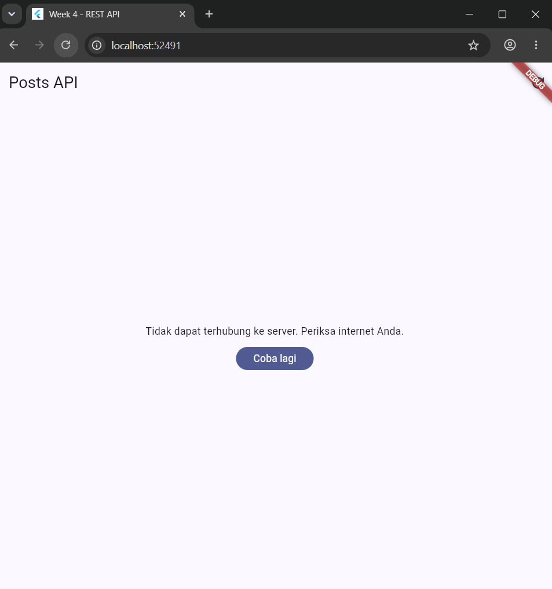

3. Nyalakan kembali internet, tekan Coba lagi.
Sementara ubah baseUrl menjadi URL salah, amati pesan error koneksi. Kembalikan setelah uji.

### Praktikum 3 — Pagination dasar

Ubah home di main.dart menjadi PagedPostPage, jalankan, dan scroll sampai bawah. Amati: halaman 1 tampil dulu, indikator muncul, data bertambah tanpa reload penuh.

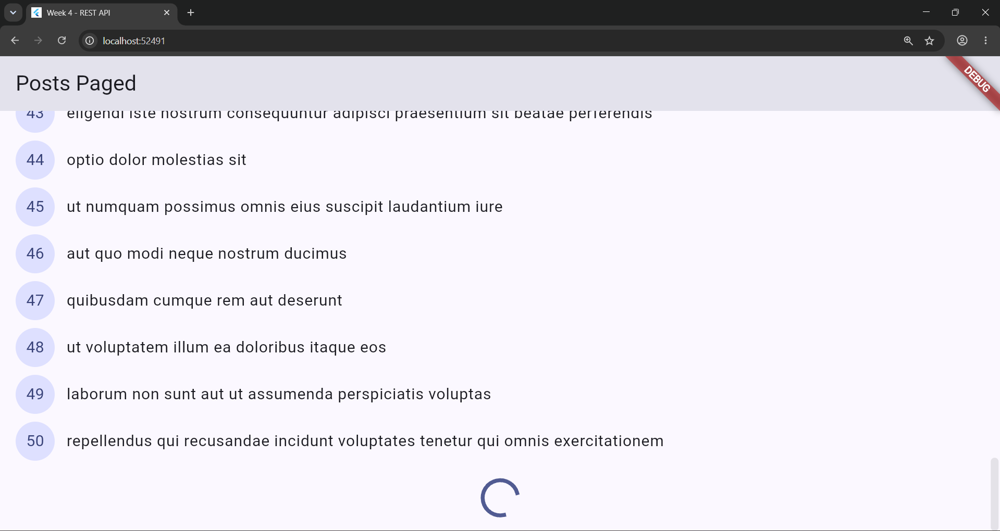

### AI Challenge

AI Verification Checklist

- Apakah UI memanggil Dio secara langsung (dilarang) atau lewat repository?
    Lewat repository. Layer UI hanya mengakses data melalui Riverpod provider (commentListProvider dan postListProvider), tidak pernah menginstansiasi atau memanggil method Dio langsung di dalam widget.

- Apakah fromJson aman null, atau masih memakai cast langsung yang bisa crash?
    Aman terhadap null. Pemetaan data menggunakan safe casting bertingkat, sehingga aman dari TypeError jika key tidak ditemukan atau nilainya null.

- Apakah semua tipe DioExceptionType (timeout, connectionError, badResponse) dipetakan ke pesan pengguna?
    Ya, dipetakan lengkap.

- Apakah baseUrl/timeout terpusat di satu client, bukan tersebar di tiap method?
    Terpusat di satu client. baseUrl dan konfigurasi timeout 10 detik dikelola secara global melalui createDio() di api_client.dart.

- Apakah test AI benar-benar menguji kasus field hilang, atau hanya happy path? Tambahkan minimal 1 edge case sendiri.
     Test bawaan AI benar-benar menguji kasus field hilang (key tidak ada) dan field bernilai null tanpa crash. Untuk memenuhi syarat, ditambahkan 1 edge case sendiri yaitu menguji payload JSON yang mengirimkan nilai ID dalam bentuk bilangan desimal/double.

- Jalankan flutter analyze dan flutter test, apakah hasil AI lolos tanpa warning? 
    Lolos

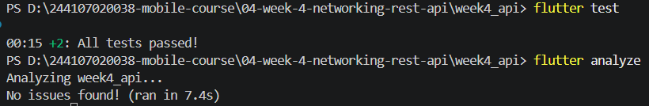

### Refactoring  

1. Ekstrak widget baris post menjadi PostTile tersendiri agar ListView.builder pendek dan mudah diuji.

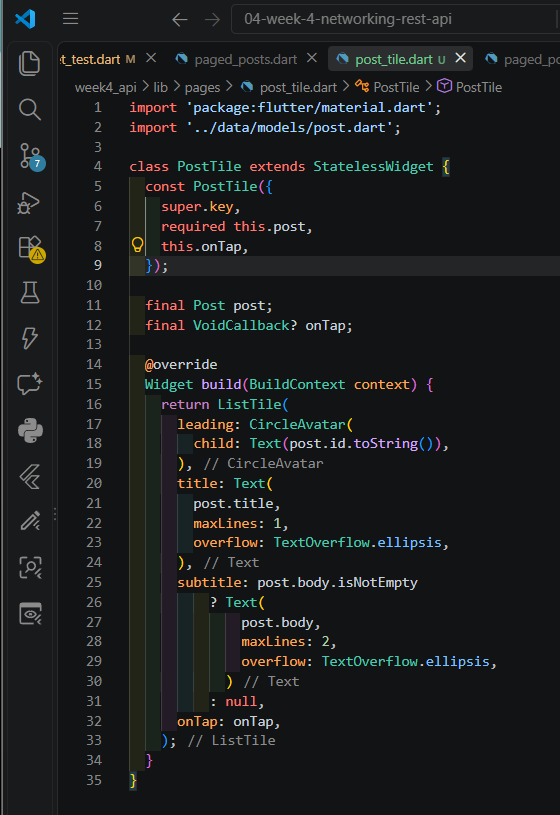

2. Pindahkan friendlyErrorMessage ke file lib/data/network_errors.dart agar bisa dipakai ulang halaman paged dan non-paged.
    Hapus blok fungsi String friendlyErrorMessage(Object error) { ... } yang ada di providers.dart, lalu tambah file network_errors.dart

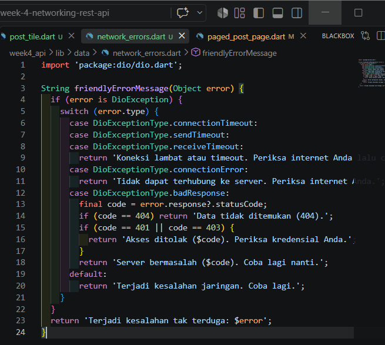

3. Tambahkan halaman detail post dengan GoRouter (/post/:id) yang menampilkan title dan body lengkap, state detail diambil dari list yang sudah dimuat atau via repository bila langsung dibuka.
    - Di file post_repository.dart, tambahkan method di dalam class PostRepository
    - Tambah provider detail di providers.dart
    - Buat halaman detail

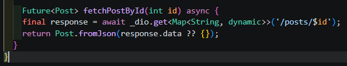
 
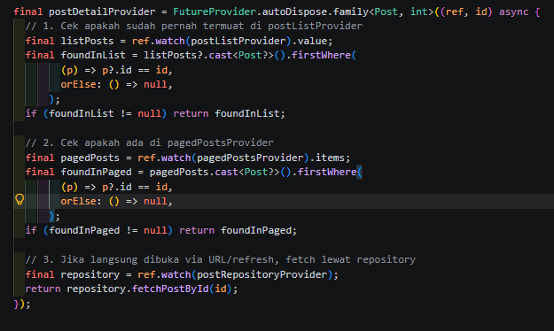

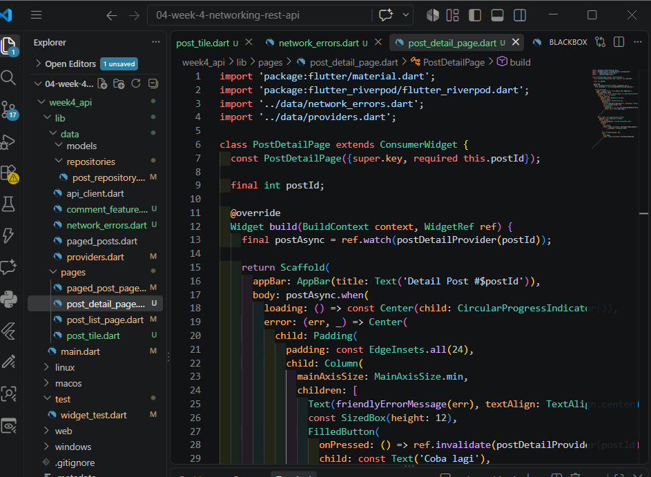

### Testing: unit test model + mock repository

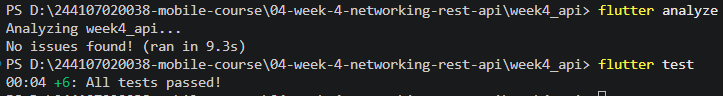

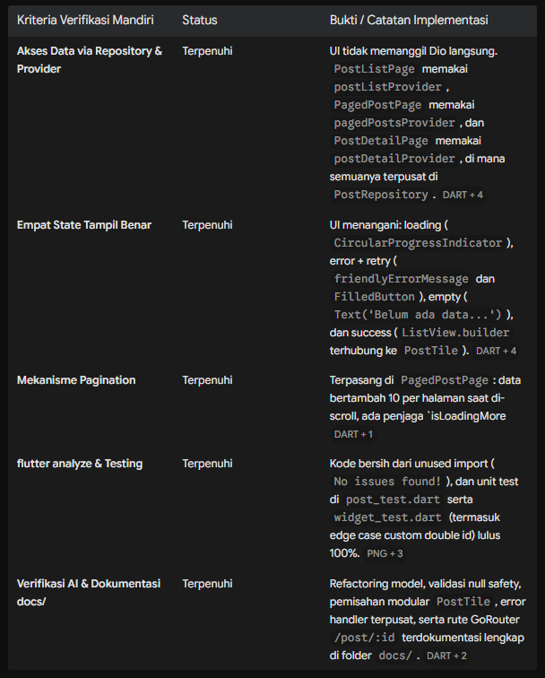

### Tugas

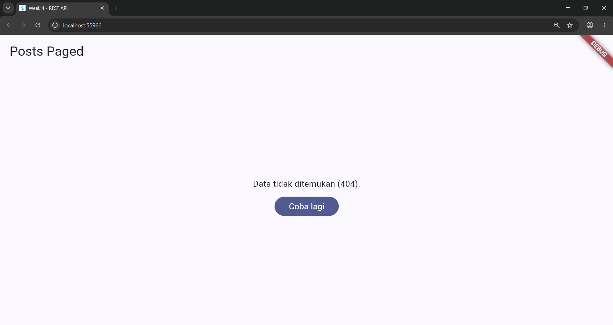

### Refleksi 

1. Mengapa UI dilarang memanggil Dio langsung? Apa yang rusak jika aturan ini dilanggar?
    Melanggar pemisahan tanggung jawab (separation of concerns), memicu duplikasi logika request, dan membuat UI mustahil diuji dengan mock/fake repository saat unit testing.

2. Kapan pagination client-side cukup, dan kapan harus mengandalkan pagination server (_page/_limit)?
    Client-side cukup untuk data kecil dan statis (di bawah 100 item). Server-side (_page/_limit) wajib untuk data dinamis atau berjumlah besar agar hemat kuota dan mencegah memori jebol.

3. Bagaimana exception repository berubah menjadi AsyncError tanpa try/catch di setiap widget? Kapan try/catch eksplisit tetap dibutuhkan?
    Riverpod membungkus fungsi provider secara otomatis; jika repository melempar error, statusnya langsung dikonversi menjadi AsyncError. try/catch eksplisit tetap wajib saat mutasi/event manual (seperti fungsi refresh() atau pagination kustom).

4. Bagian mana dari hasil AI yang Anda perbaiki, dan mengapa?
    Memperbaiki getter Riverpod dari .valueOrNull ke .value, menambahkan export 'network_errors.dart'; di providers.dart agar testing tidak rusak, dan menyetel rute utama ke PagedPostPage agar pagination berjalan
