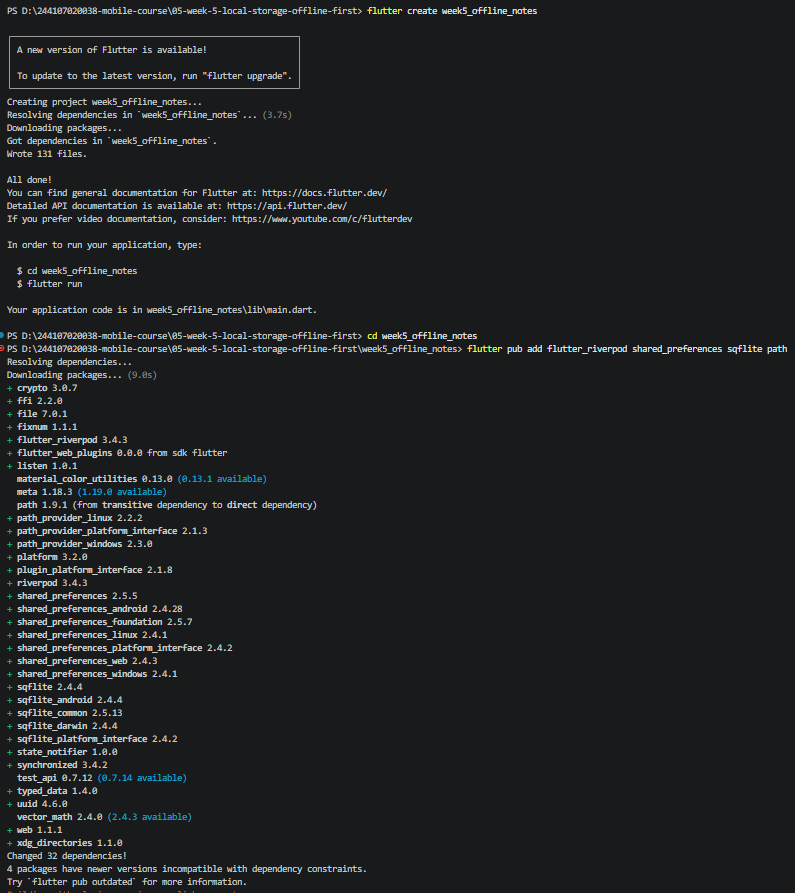
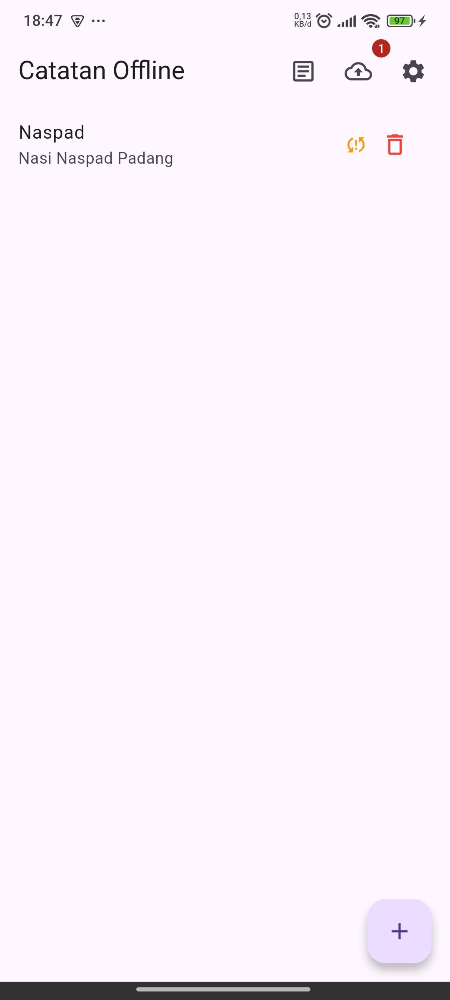
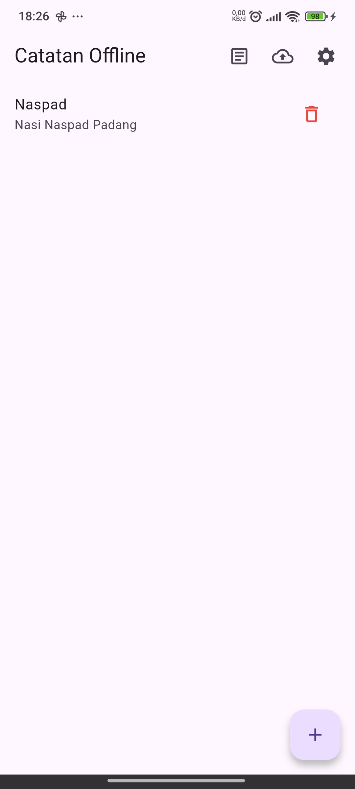
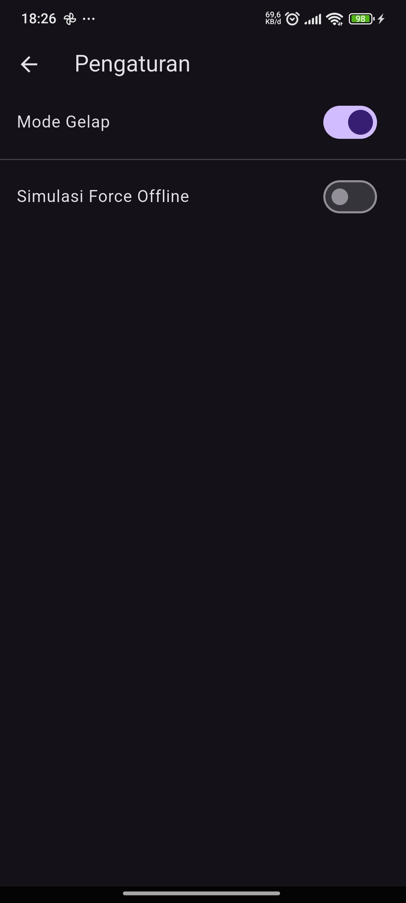
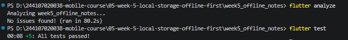
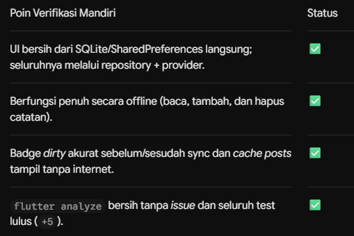
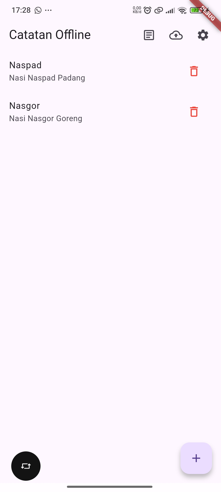
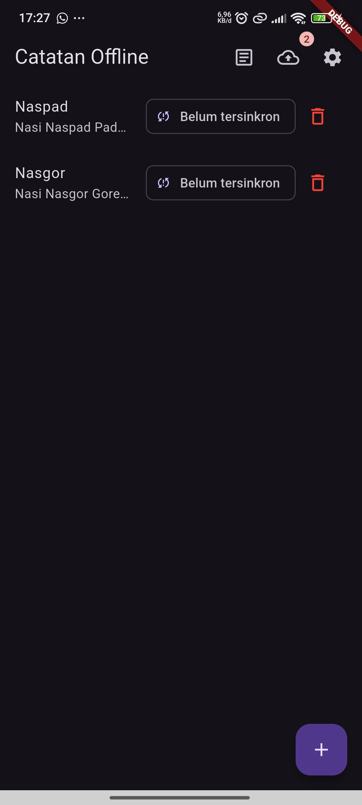
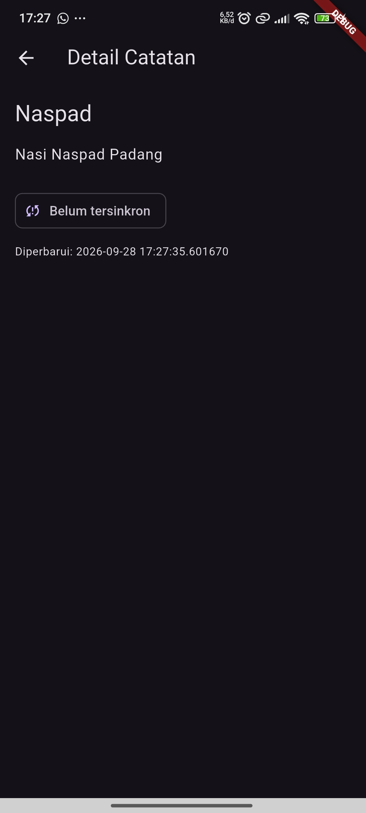

|  | Pemrograman Mobile |
|--|--|
| NIM |  244107020038|
| Nama |  Nayla Akas Oktavia |
| Kelas | TI - 3H |
| Repository | [link] (https://github.com/naylaakas/244107020038-mobile-course/tree/main/05-week-5-local-storage-offline-first) |

# WEEK 5
## Local Storage & Offline First

### Praktikum 1 — SharedPreferences

- Buat project baru 




### Praktikum 2 — SQLite dan repository catatan

Buat lib/data/local/note.dart
Buat lib/data/local/db.dart
Buat lib/data/repositories/note_repository.dart

### Praktikum 3 — Cache-first dan antrean sync







### AI Challenge

1. Tabel perbandingan SharedPreferences, Hive, sqflite (SQLite), dan Drift

| Kriteria | SharedPreferences | Hive | sqflite (SQLite) | Drift |
|---|---|---|---|---|
| Kompleksitas query | Rendah | Rendah-Menengah | Tinggi | Tinggi |
| Kebutuhan relasi | Tidak cocok | Terbatas | Baik | Baik |
| Reaktivitas / Stream | Terbatas | Mendukung watch | Perlu implementasi sendiri | Baik |
| Type-safety | Rendah | Cukup | Sedang | Tinggi |
| Boilerplate | Sangat sedikit | Sedikit | Sedang | Lebih banyak |
| Testing | Mudah | Relatif mudah | Baik | Baik |

2. Keputusan

| Kebutuhan | Pilihan | Alasan |
|---|---|---|
| Preferensi tema | SharedPreferences | Data hanya berupa preferensi sederhana seperti `darkMode = true/false`, sehingga key-value storage sudah mencukupi. |
| Catatan | sqflite (SQLite) | Catatan merupakan koleksi data yang membutuhkan CRUD, query, `updated_at`, dan `dirty` untuk kebutuhan sinkronisasi offline. SQLite juga mendukung data dalam jumlah besar dan struktur relasional. |

3. Trade-off Setiap Pilihan

    - SharedPreferences

        - Kelebihan: sederhana dan cocok untuk data key-value
        - Kekurangan: tidak cocok untuk koleksi catatan dan query kompleks

    - Hive

        - Kelebihan: sederhana dan cocok untuk penyimpanan object lokal
        - Kekurangan: kurang cocok untuk relasi dan query kompleks

    - sqflite

        - Kelebihan: mendukung SQL, CRUD, relasi, dan data dalam jumlah besar
        - Kekurangan: perlu SQL, mapping model, dan pengelolaan migration

    - Drift

        - Kelebihan: type-safe, mendukung query reaktif dan relasi
        - Kekurangan: setup lebih kompleks karena membutuhkan code generation

4. Skema Database untuk 1000+ Catatan

```text
┌─────────────────────────────────────┐
│               notes                 │
├─────────────────────────────────────┤
│ id          INTEGER PRIMARY KEY     │
│ title       TEXT NOT NULL           │
│ body        TEXT NOT NULL           │
│ updated_at  TEXT NOT NULL           │
│ dirty       INTEGER NOT NULL        │
└─────────────────────────────────────┘

CREATE TABLE notes(
  id INTEGER PRIMARY KEY AUTOINCREMENT,
  title TEXT NOT NULL,
  body TEXT NOT NULL DEFAULT '',
  updated_at TEXT NOT NULL,
  dirty INTEGER NOT NULL DEFAULT 0
);

```

AI Verification Checklist

- Apakah AI menempatkan daftar catatan di SharedPreferences? (menolak: rapuh untuk koleksi)

    Tidak, AI menempatkan SharedPreferences untuk kebutuhan preferensi sederhana,
seperti tema aplikasi

- Apakah skema AI mendukung antrean sync (dirty flag / updated_at) atau hanya CRUD polos?

    Ya, Terdapat `dirty` untuk menandai catatan yang belum sinkron dan `updated_at` untuk mencatat waktu perubahan

- Apakah klaim "real-time" AI didukung stream (Drift/watch) atau hanya asumsi?
    
    Tidak pada implementasi sqflite ini. Repository menggunakan `Future`. Reactive stream tersedia pada pilihan seperti Drift melalui `watch()`

- Apakah estimasi boilerplate AI masuk akal setelah Anda mencoba instalasinya (flutter pub add + migrasi skema)?
    
    Ya, sqflite membutuhkan SQL, model, repository, dan migration. Drift membutuhkan setup tambahan seperti code generation. Hive dan Drift belum diuji langsung dalam project ini

- Keputusan final Anda beserta alasannya, boleh berbeda dari rekomendasi AI selama berargumen.
     
     SharedPreferences untuk preferensi tema dan sqflite untuk catatan, karena sesuai dengan kebutuhan aplikasi dan mendukung data 1000+ catatan serta sinkronisasi offline.

### Refactoring  

1. Ekstrak baris catatan menjadi widget NoteTile tersendiri yang menampilkan badge "belum tersinkron" bila dirty == true.
2. Pindahkan logika cache posts dan syncNotes ke file lib/data/sync.dart agar repository tetap fokus pada CRUD.
3. Tambahkan halaman detail catatan dengan GoRouter (/note/:id) yang membaca dari repository lokal, bukan dari state halaman list.

### Testing: unit test model + mock repository





### Tugas

- tema terang



- tema gelap



- sebelum sync


- sesudah sync


- detail catatan



### Refleksi 

1. Mengapa daftar catatan tidak boleh disimpan di SharedPreferences? Apa yang rusak jika aturan ini dilanggar?
    SharedPreferences bukan untuk menyimpan daftar catatan karena hanya cocok untuk data kecil. Jika dipaksakan, data bisa sulit dikelola dan tidak konsisten.

2. Kapan cache-first cukup, dan kapan Anda membutuhkan strategi lain (misalnya network-first untuk data harga real-time)?
    Cache-first cocok untuk data yang tidak perlu selalu terbaru. Untuk data real-time seperti harga, gunakan network-first.

3. Bagaimana dirty flag berubah menjadi antrean sync tanpa memblokir UI? Kapan antrean terpisah (tabel outbox) menjadi perlu?
    Dirty flag menandai data yang belum tersinkronisasi, lalu sync dilakukan secara asynchronous agar UI tidak terblokir. Outbox diperlukan jika banyak perubahan harus diantrikan dan dijamin tidak hilang.

4. Bagian mana dari rekomendasi AI yang Anda tolak, dan mengapa?
    Saya menolak rekomendasi AI yang menyarankan penambahan blok try-catch manual di dalam FutureProvider. Alasannya, hal tersebut menelan exception asli, membuat unit test gagal, dan memicu timeout.