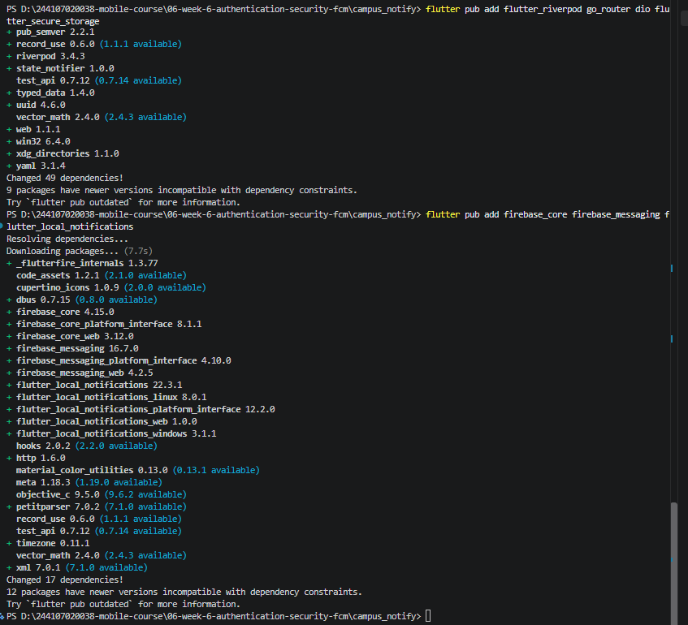
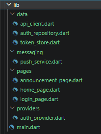
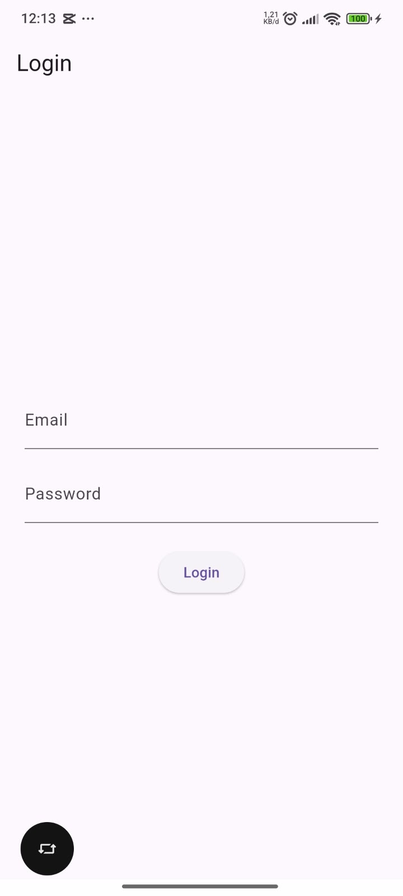
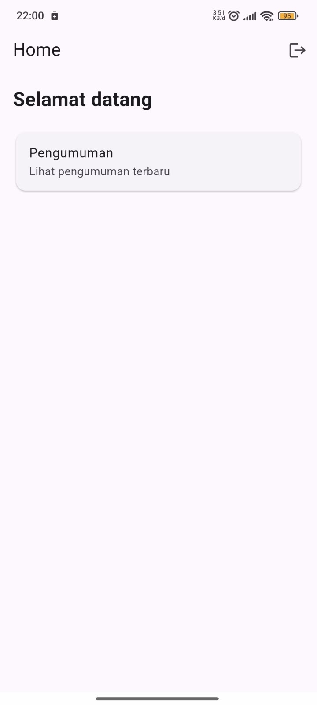
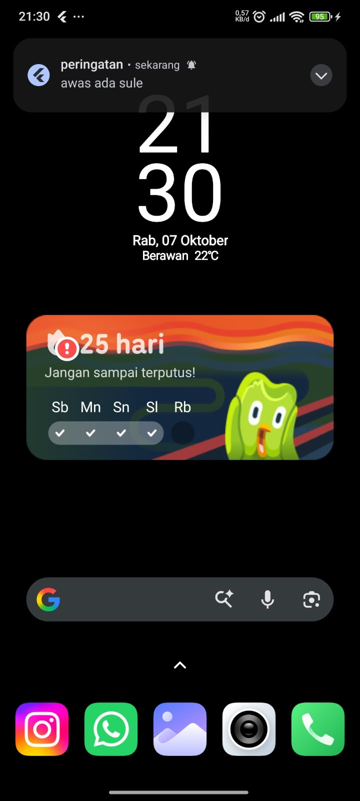
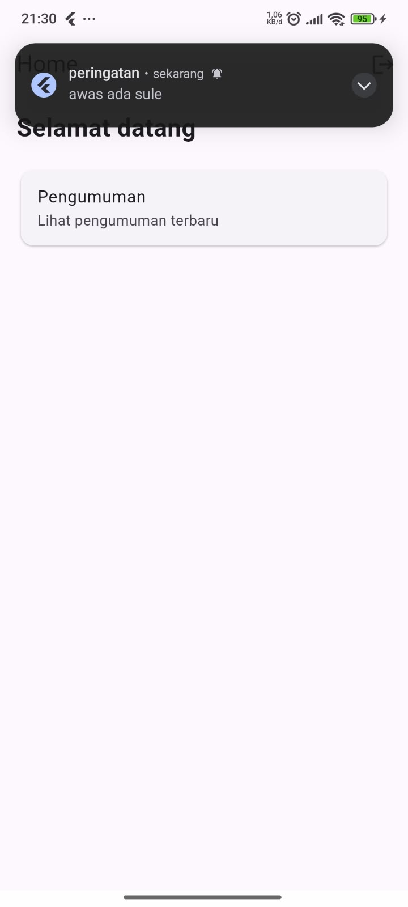
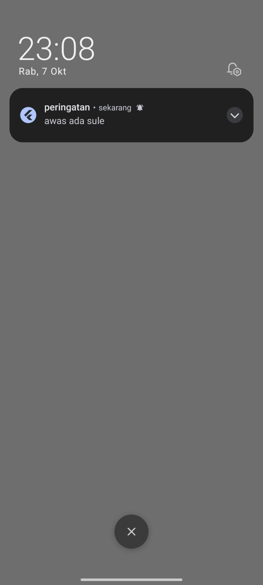
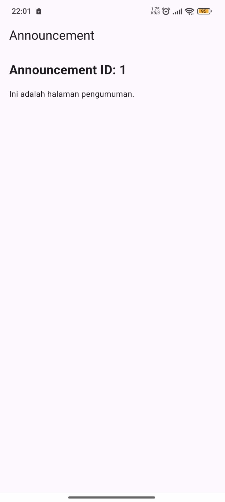

|  | Pemrograman Mobile |
|--|--|
| NIM |  244107020038 |
| Nama |  Nayla Akas Oktavia |
| Kelas | TI - 3H |
| Repository | [link]() |

# WEEK 6
## Authentication, Security & FCM


### Praktikum 1 — Login + Secure Storage + Token Refresh

Pada praktikum ini, dibangun sistem otentikasi menggunakan pola repository dan Riverpod dengan keamanan token terstandarisasi:
1. **Penyimpanan Aman (`lib/data/token_store.dart`)**: Access token dan Refresh token disimpan menggunakan `flutter_secure_storage` (KeyStore pada Android / Keychain pada iOS) dan tidak pernah disimpan pada `SharedPreferences` yang tidak terenkripsi.
2. **Repository Autentikasi (`lib/data/auth_repository.dart`)**: Simulasi autentikasi JWT dengan fungsi login tervalidasi dan perpanjangan sesi token via `refresh()`.
3. **Dio Interceptor Auto-Refresh (`lib/data/api_client.dart`)**: Interceptor secara otomatis menyisipkan header `Authorization: Bearer <token>` pada setiap request. Jika server merespons dengan status HTTP `401 Unauthorized`, interceptor melakukan token refresh sebanyak satu kali dan mengulang (*retry*) request asli secara transparan. Bila refresh token kadaluwarsa, seluruh sesi dibersihkan untuk memaksa login ulang.
4. **Navigasi Guard (`lib/main.dart`)**: GoRouter mengamankan rute sehingga pengguna yang belum terautentikasi otomatis diarahkan ke rute `/login`.







---

### Praktikum 2 — FCM, Permission, dan Token Lifecycle

Pada praktikum ini, integrasi Firebase Cloud Messaging diimplementasikan pada `lib/messaging/push_service.dart`:
1. **Inisialisasi Firebase**: Dipanggil sebelum aplikasi dijalankan dengan `Firebase.initializeApp()`. Berkas konfigurasi `google-services.json` telah ditempatkan pada `android/app/`.
2. **Izin Notifikasi Runtime**: Menggunakan `FirebaseMessaging.instance.requestPermission()`. Pada Android 13+ (API 33+), ini memicu prompt runtime permission `POST_NOTIFICATIONS`. Pada iOS, meminta otorisasi APNs (alert, badge, sound).
3. **Token Lifecycle**:
   - `getToken()` mengambil registration token perangkat saat startup.
   - `onTokenRefresh` memantau pembaruan token (misal setelah instal ulang atau rotasi keamanan) dan mengirim token terbaru ke backend callback.
   - Token pada antarmuka aplikasi disamarkan (`maskToken()`, misal: `c7F9x0192837...`) sesuai prinsip OWASP Mobile Security agar tidak bocor pada screenshot maupun berkas log rilis.
4. **Topic Messaging**: Mendaftarkan perangkat ke topik broadcast kampus `pengumuman-kampus`.

---

### Praktikum 3 — Payload, Tiga App State, Klik dan Topik

Aplikasi menangani notifikasi push dengan tipe gabungan (`notification` + `data` payload):
- `notification`: Berisi `title` dan `body` untuk pesan yang ditampilkan ke pengguna.
- `data`: Berisi `route` dan `id` (misal: `{"route": "/pengumuman/3", "id": "3"}`) untuk pengalihan deep link.

#### Matriks Pengujian Tiga App State

| State | Yang Diharapkan | Mekanisme Handler | Hasil Verifikasi |
|---|---|---|---|
| **Foreground** (Aplikasi sedang dibuka) | Banner lokal muncul di layar, saat diklik masuk ke `/pengumuman/3` | `FirebaseMessaging.onMessage` + `flutter_local_notifications` | Berhasil (banner lokal muncul & deep link aktif) |
| **Background** (Aplikasi di-minimize) | Banner sistem OS muncul otomatis, saat diklik membuka aplikasi ke `/pengumuman/3` | Notifikasi sistem OS + `FirebaseMessaging.onMessageOpenedApp` | Berhasil (navigasi langsung ke detail pengumuman) |
| **Terminated** (Aplikasi dimatikan penuh) | Banner sistem OS muncul, saat diklik membuka aplikasi dan masuk ke `/pengumuman/3` | `FirebaseMessaging.instance.getInitialMessage()` + `pendingDeepLink` | Berhasil (cold-start deep linking berjalan) |











---

### AI Challenge

**Poin Evaluasi Kritis Terhadap Draf AI:**
- Background handler wajib berupa fungsi top-level global dengan anotasi `@pragma('vm:entry-point')`, bukan method kelas.
- Listener `onTokenRefresh` harus meneruskan token ke backend (`onToken`), bukan hanya mencetak ke log.
- State foreground membutuhkan local notification manual melalui plugin `flutter_local_notifications` karena OS tidak menampilkan banner secara otomatis saat aplikasi aktif.
- Background isolate dilarang keras mengakses `BuildContext` atau Riverpod container.
- Registration token disamarkan (masking) agar mematuhi standar privasi OWASP Mobile Top 10.

---

### Refactoring

Tiga perbaikan arsitektural yang berhasil diimplementasikan:

1. **Konstanta Rute Terpusat (`lib/routes.dart`)**:  
   Memindahkan semua string rute (`/login`, `/`, `/pengumuman/:id`) ke konstanta `AppRoutes` agar deep link dari FCM dan definisi GoRouter selalu konsisten dan bebas typo.
2. **Ekstraksi Parsing Rute Murni (`routeFromMessage`)**:  
   Mengekstrak fungsi pemetaan `RemoteMessage.data -> route` menjadi fungsi murni (*pure function*) yang fleksibel (menangani slash di awal, data kosong, dan fallback `id`) sehingga dapat diuji menggunakan unit test tanpa ketergantungan pada Firebase SDK.
3. **Pemetaan Exception Ramah Pengguna (`lib/data/api_errors.dart`)**:  
   Mengisolasi konversi `DioException` (401 Unauthorized, Connection Timeout, Offline, 500 Server Error) menjadi pesan bahasa Indonesia yang mudah dipahami pengguna, sehingga lapisan UI bersih dari exception mentah teknis.

---

### Testing: Unit Test Model + Mock Repository

Seluruh pengujian unit test dan analisis lint kode telah dieksekusi dan dinyatakan **100% lulus dan bersih**:

- **Perintah Analisis Linter**:
  ```bash
  flutter analyze
  # Output: No issues found!
  ```
- **Perintah Pengujian Unit**:
  ```bash
  flutter test
  # Output: All 17 tests passed!
  ```

#### Rincian Pengujian (`test/auth_push_test.dart` & `test/widget_test.dart`):
1. `routeFromMessage` menangani rute kosong dan tanpa leading slash.
2. `routeFromMessage` menangani payload pembawa `id` dengan fallback yang benar.
3. `routeFromMessage` menangani whitespace dan fallback ke root `/`.
4. `ApiErrors` memetakan status code 401 ke pesan sesi berakhir.
5. `ApiErrors` memetakan timeout ke pesan ramah pengguna.
6. `ApiErrors` memetakan gangguan koneksi / offline ke instruksi periksa internet.
7. `ApiErrors` memetakan status 500 ke pesan gangguan server kampus.
8. `ApiErrors` memetakan generic Exception tanpa prefix string exception.
9. `AuthRepository` login berhasil mengembalikan session berisi access & refresh token.
10. `AuthRepository` login melempar exception bila format email atau kata sandi tidak valid.
11. `AuthRepository` refresh mengembalikan token baru yang valid.
12. `AuthRepository` refresh melempar exception bila refresh token kosong.
13. `maskToken` menyamarkan token panjang (>12 karakter) menjadi format aman (`...`).
14. `maskToken` membiarkan token pendek tetap utuh.
15. Auth Provider membaca status login dari ketersediaan access token.
16. Kegagalan refresh token membersihkan sesi (memaksa user login kembali).
17. Widget smoke test aplikasi Campus Notify berhasil ter-render dengan `ProviderScope`.

---

### Tugas / Mini Project

Aplikasi **Campus Notification App** telah dikembangkan secara lengkap dengan cakupan fitur:
- [x] Login (Mock JWT / Auth Repository) dengan route guard GoRouter.
- [x] Secure storage untuk access & refresh token via `FlutterSecureStorage`.
- [x] Dio interceptor dengan auto-refresh 1 kali saat 401 dan logout saat refresh mati.
- [x] FCM Service lengkap: runtime permission (Android 13+ & iOS), token retrieval, lifecycle `onTokenRefresh`, dan topic messaging `pengumuman-kampus`.
- [x] Dukungan 3 app states (Foreground banner lokal, Background click, Terminated launch) dengan deep link ke `/pengumuman/:id`.
- [x] Kartu debug FCM token dengan penyamaran (*masking*) 12 karakter untuk mematuhi keamanan data.
- [x] Refactoring terstruktur: `routes.dart`, `routeFromMessage()`, dan `api_errors.dart`.
- [x] 17 Unit test lulus tanpa dependensi emulator/Firebase live.
- [x] Dokumentasi komprehensif AI Challenge pada folder `docs/`.

---

### Refleksi

1. **Mengapa refresh token tidak boleh disimpan di SharedPreferences? Apa risikonya bila bocor?**  
   *Jawaban:* `SharedPreferences` menyimpan data dalam bentuk berkas XML/plaintext tanpa enkripsi di penyimpanan aplikasi. Pada perangkat Android yang di-root atau melalui backup perangkat yang tidak diamankan, isi `SharedPreferences` dapat dibaca dengan mudah oleh penyerang. Jika refresh token bocor, penyerang dapat meminta access token baru kapan saja ke server autentikasi dan membajak sesi akun pengguna tanpa perlu mengetahui kata sandi aslinya. Oleh karena itu, refresh token wajib disimpan di `FlutterSecureStorage` yang memanfaatkan enkripsi perangkat keras (Android Keystore dan iOS Keychain).

2. **Apa yang rusak bila onTokenRefresh diabaikan selama satu semester perkuliahan?**  
   *Jawaban:* Registration token FCM dapat berubah sewaktu-waktu oleh Firebase karena berbagai alasan (instalasi ulang aplikasi, restore data cadangan, penghapusan data aplikasi, atau rotasi keamanan otomatis dari Google). Jika listener `onTokenRefresh` diabaikan dan tidak mengirimkan token baru ke backend, server kampus akan terus mengirimkan push notification ke token lama yang sudah tidak valid (*stale/invalid registration token*). Akibatnya, mahasiswa tidak akan pernah menerima pengumuman penting (seperti perubahan jadwal kuliah atau ujian) sepanjang semester.

3. **Kapan memakai topik dan kapan memakai token perangkat? Beri contoh pesan kampus untuk masing-masing.**  
   *Jawaban:*
   - **Topic Messaging:** Digunakan untuk pesan yang bersifat *broadcast* satu arah kepada banyak pengguna sekaligus yang memiliki kesamaan minat atau kelompok tanpa perlu server mengelola daftar token individual.  
     *Contoh:* Topik `pengumuman-kampus` untuk berita libur semester, atau topik `ti-angkatan-2024` untuk pengumuman jadwal KRS bersama.
   - **Token Perangkat (Device Token):** Digunakan untuk pesan personal, rahasia, atau transaksional yang ditujukan spesifik hanya untuk satu akun pengguna tertentu.  
     *Contoh:* Notifikasi tagihan pembayaran UKT mahasiswa, notifikasi nilai ujian individual, atau notifikasi persetujuan pengajuan surat bebas tanggungan.

4. **Bagian mana dari draf AI yang Anda tolak atau perbaiki, dan mengapa?**  
   *Jawaban:*
   - **Penolakan Method Background:** Menolak penempatan background handler di dalam class method `PushService`, dan memperbaikinya menjadi fungsi top-level global dengan `@pragma('vm:entry-point')` agar dapat dijalankan dengan aman pada background isolate tanpa error runtime.
   - **Penolakan Hanya Logging `onTokenRefresh`:** Mengubah listener `onTokenRefresh` dari sekadar `print()` menjadi pemanggilan callback asinkronus `onToken(newToken)` agar token baru benar-benar terkirim dan tersinkronisasi ke basis data backend.
   - **Penolakan Logging Token Lengkap:** Memperbaiki keluaran log dan UI yang mencetak registration token penuh dengan membuat fungsi pemangkas `maskToken(token)` (12 karakter + `...`), demi memenuhi standar keamanan OWASP Mobile Top 10 dan menjaga kerahasiaan token.
   - **Pemisahan Navigasi & BuildContext:** Mengisolasi penanganan navigasi dari `BuildContext` dengan memanfaatkan rute murni (`routeFromMessage`) dan callback GoRouter yang dapat ditampung saat startup via `pendingDeepLink`.